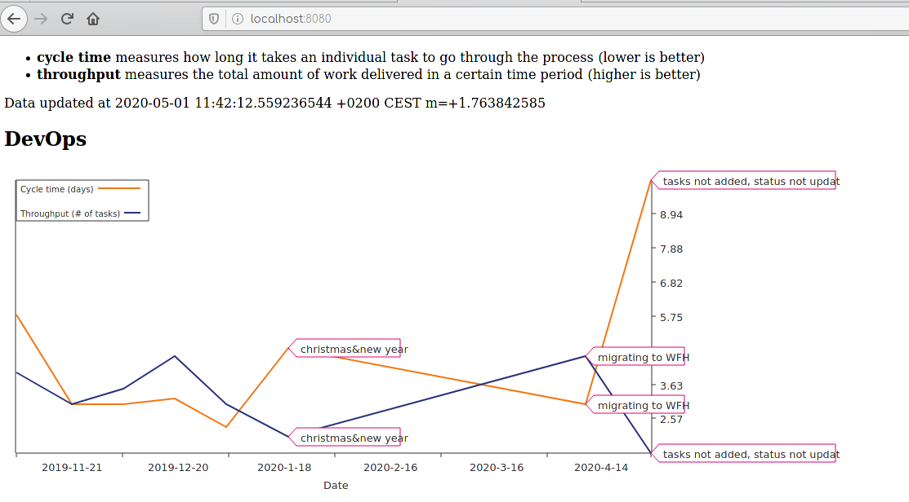

# team-metrics

This project creates a web service that can get kanban team metrics from Google
Sheet spreadsheet and display charts for cycle time and throughput for one or
multiple teams.

The sheet name must be equal to the team name (see example sheet)

1. Go to
[this](https://developers.google.com/sheets/api/quickstart/go#step_1_turn_on_the)
link to enable Google Sheets API and get the credentials JSON file.
2. Compile with ``go build ./...``
3. ``export CREDENTIALS=(path to the credentials JSON file)``
4. ``export SHEET_ID=(google sheet id)``. You can get the id from the Sheet URL
4. Run the program and authenticate with your Google account (the program will
   create another authentication JSON file

The service is available at ``http://localhost:8080``.

Check out the example sheet that was exported to ``example.xlsx``. You can
import that into your Google Sheets.
